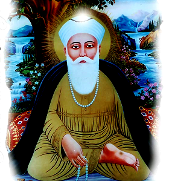

[[sachi-taksaal-japji-sahib]]
[[copyright-c-2017-shivdeep-singh-manhasshivdeep-gmail-com]]
= Minting Truth in The Foundry of Reality
:toc: left

Copyright (c) 2017 - Shivdeep Singh
<mailto:manhasshivdeep%40gmail.com[manhasshivdeep@gmail.com]>

This is a Sample Book. Designed in asciidoctor.

[[table-of-contents]]
*Table of Contents*

* link:#preface[Preface]
** link:#about-the-author[About the author]
** link:#about-this-book[About this book]
** link:#license[License]
* link:#introduction[Introduction]
** link:#section-1[Section 1]
** link:#section-2[Section 2]
* link:#basics-and-beyond[Basics and Beyond]
** link:#physics-of-samkhya[*Physics of Samkhya*]
** link:#akash-tattva-shabad-and-param-tatva[*Akash Tattva, Shabad and
Param Tatva*]
** link:#naam-and-niranjan[*Naam and Niranjan*]
** link:#eka-mai-yukti[Eka Mai, Yukti]
* link:#unity-or-trinity-of-divinity[Unity or Trinity of Divinity]
* link:#numerical-metaphors[Numerical Metaphors]
* link:#truth[Truth]
* link:#questions[Questions]
* link:#observations[Observations]
* link:#the-will[The Will]
* link:#unity[Unity]
* link:#lessons-from-the-teacher[Lessons from the Teacher]
* link:#listen[Listen]
* link:#accept[Accept]
* link:#amazement[Amazement]
* link:#the-riddle-of-the-five[The Riddle of the Five]
* link:#existence-beyond-attributes[Existence beyond Attributes]
* link:#the-infinite-nature[The Infinite Nature]
* link:#language[Language]
* link:#the-ritual-bath[The Ritual Bath]
* link:#when-where-how-who-knows[When? Where? How? Who knows!]
* link:#no-end-to-an-end[No end to an End]
* link:#priceless[Priceless]
* link:#the-home[The Home]
* link:#the-conqueror[The Conqueror]
* link:#salutations[Salutations]
* link:#the-five-stages[The Five Stages]
** link:#the-resting-place[*The Resting place*]
** link:#the-ability[*The Ability*]
** link:#the-realisation[*The Realisation*]
** link:#the-beauty[*The Beauty*]
** link:#the-truth[*The Truth*]
* link:#the-mint[The Mint]
* link:#freedom[Freedom]
* link:#references[References]
** link:#demo-usage[Demo Usage]
** link:#books[Books]
** link:#credits-for-formatting[Credits for formatting]

[[preface]]
[[preface]]
link:#table-of-contents[Preface]
--------------------------------

[[contents]]
*Contents*

* link:#about-the-author[About the author]
* link:#about-this-book[About this book]
** link:#prerequisites[Prerequisites]
** link:#conventions[Conventions]
** link:#how-to-contribute[How to contribute]
** link:#publishing[Publishing]
* link:#license[License]

[[about-the-author]]
[[about-the-author]]
link:#contents[About the author]
~~~~~~~~~~~~~~~~~~~~~~~~~~~~~~~~

Shivdeep Singh is an Engineer by profession.

[[about-this-book]]
[[about-this-book]]
link:#contents[About this book]
~~~~~~~~~~~~~~~~~~~~~~~~~~~~~~~

This book tries to explore the content of Japuji. This paper seeks to
translate the morning prayer to an enquiring mind

[[prerequisites]]
[[prerequisites]]
link:#contents[Prerequisites]
^^^^^^^^^^^^^^^^^^^^^^^^^^^^^

[[conventions]]
[[conventions]]
link:#contents[Conventions]
^^^^^^^^^^^^^^^^^^^^^^^^^^^

[[how-to-contribute]]
[[how-to-contribute]]
link:#contents[How to contribute]
^^^^^^^^^^^^^^^^^^^^^^^^^^^^^^^^^

[[publishing]]
[[publishing]]
link:#contents[Publishing]
^^^^^^^^^^^^^^^^^^^^^^^^^^

[[license]]
[[license]]
link:#contents[License]
~~~~~~~~~~~~~~~~~~~~~~~

This work is licensed under a
https://creativecommons.org/licenses/by-nc-sa/4.0/[Creative Commons
Attribution-Non Commercial-Share Alike 4.0 International License]. You
are free to:

* *Share* — copy and redistribute the material in any medium or format
* *Adapt* — remix, transform, and build upon the material

The licensor cannot revoke these freedoms as long as you follow the
license terms.

*Code*

The code is licensed under the link:LICENSE-code.txt[OSI-approved BSD
2-Clause License].

[[introduction]]
[[introduction]]
link:#table-of-contents[Introduction]
-------------------------------------

[[id1]]
*Contents*

* link:#section-1[Section 1]
* link:#section-2[Section 2]

[[section-1]]
[[section-1]]
link:#id1[Section 1]
~~~~~~~~~~~~~~~~~~~~

Note

This contains my notes on Japji Sahib

[[section-2]]
[[section-2]]
link:#id1[Section 2]
~~~~~~~~~~~~~~~~~~~~

[[basics-and-beyond]]
[[basics-and-beyond]]
link:#table-of-contents[Basics and Beyond]
------------------------------------------

[[id2]]
*Contents*

* link:#physics-of-samkhya[*Physics of Samkhya*]
* link:#akash-tattva-shabad-and-param-tatva[*Akash Tattva, Shabad and
Param Tatva*]
* link:#naam-and-niranjan[*Naam and Niranjan*]
* link:#eka-mai-yukti[Eka Mai, Yukti]

[[physics-of-samkhya]]
[[physics-of-samkhya]]
link:#id2[*Physics of Samkhya*]
~~~~~~~~~~~~~~~~~~~~~~~~~~~~~~~

Samkhya physics goes like this.

[width="100%",cols="39%,61%",options="header",]
|===============
|Number |Element
|5 |Sky
|===============

[[akash-tattva-shabad-and-param-tatva]]
[[akash-tattva-shabad-and-param-tatva]]
link:#id2[*Akash Tattva, Shabad and Param Tatva*]
~~~~~~~~~~~~~~~~~~~~~~~~~~~~~~~~~~~~~~~~~~~~~~~~~

[[naam-and-niranjan]]
[[naam-and-niranjan]]
link:#id2[*Naam and Niranjan*]
~~~~~~~~~~~~~~~~~~~~~~~~~~~~~~

[[eka-mai-yukti]]
[[eka-mai-yukti]]
link:#id2[Eka Mai, Yukti]
~~~~~~~~~~~~~~~~~~~~~~~~~

1 unity

sab gobind hai and not tawheed.

2 duality

3 Attributes/gunas

3 tridev/maya

4 ved

[[unity-or-trinity-of-divinity]]
[[unity-or-trinity-of-divinity]]
link:#table-of-contents[Unity or Trinity of Divinity]
-----------------------------------------------------

[[numerical-metaphors]]
[[numerical-metaphors]]
link:#table-of-contents[Numerical Metaphors]
--------------------------------------------

[[truth]]
[[truth]]
link:#table-of-contents[Truth]
------------------------------

=== Abstract
Timeless

[[questions]]
[[questions]]
link:#table-of-contents[Questions]
----------------------------------

=== Abstract
How to define a life worth living?

[[observations]]
[[observations]]
link:#table-of-contents[Observations]
-------------------------------------

=== Abstract
Mind is restless +
Desires are hard to please +

[[the-will]]
[[the-will]]
link:#table-of-contents[The Will]
---------------------------------
=== Abstract
Everything is here +
Tough to reconcile and understand +

[[unity]]
[[unity]]
link:#table-of-contents[Unity]
------------------------------

=== Abstract
Unity of Existence, Diversity springs from Unity,
Recognise the base.

[[lessons-from-the-teacher]]
[[lessons-from-the-teacher]]
link:#table-of-contents[Lessons from the Teacher]
-------------------------------------------------
=== Abstract
Obedience is the first lesson +
Being humble always is the things to be pondered on continuously +
Oneness of the existing reality, conscious or para conscious +
Thousands of opinions are here +
Let no one believe that alone is correct. 

[[listen]]
[[listen]]
link:#table-of-contents[Listen]
-------------------------------
=== Abstract

Listen to the people, listen to the music which resounds.
Listening is the word, essence is observation

[[accept]]
[[accept]]
link:#table-of-contents[Accept]
-------------------------------
=== Abstract
Accept the the information observed +
Ponder over it, process it and find in yourself an observer +
Aatam tatva cheenho

[[amazement]]
[[amazement]]
link:#table-of-contents[Amazement]
----------------------------------
=== Abstract
There is no end to an end, this amazes me

[[the-riddle-of-the-five]]
[[the-riddle-of-the-five]]
link:#table-of-contents[The Riddle of the Five]
-----------------------------------------------
=== Abstract
Which Five are ?

. Acceptable
. Dominant
. Honourable
. Find place in the King's durbaar
. Concentrate on the one

This has a clear relation to Samkhya 25 tatva

[[existence-beyond-attributes]]
[[existence-beyond-attributes]]
link:#table-of-contents[Existence beyond Attributes]
----------------------------------------------------
=== Abstract
Define the attributes, +
Triguna +
Imagine that there is something beyond

[[the-infinite-nature]]
[[the-infinite-nature]]
link:#table-of-contents[The Infinite Nature]
--------------------------------------------
=== Abstract
Finiteness is also an attribute +
Imagine non finiteness

[[language]]
[[language]]
link:#table-of-contents[Language]
---------------------------------
=== Abstract
What is the language of love +
What language invites grace?

[[the-ritual-bath]]
[[the-ritual-bath]]
link:#table-of-contents[The Ritual Bath]
----------------------------------------
=== Abstract
Is the ritual enough to get you something?

[[when-where-how-who-knows]]
[[when-where-how-who-knows]]
link:#table-of-contents[When? Where? How? Who knows!]
-----------------------------------------------------
=== Abstract
It would be great If I know someone who knows +
But what is the limit of his knowledge

[[no-end-to-an-end]]
[[no-end-to-an-end]]
link:#table-of-contents[No end to an End]
-----------------------------------------
=== Abstract
Existence of reality knows no bounds

[[priceless]]
[[priceless]]
link:#table-of-contents[Priceless]
----------------------------------
=== Abstract
Appreciate the pricelessness of the existence +
See and feel the beauty +

[[the-home]]
[[the-home]]
link:#table-of-contents[The Home]
---------------------------------
=== Abstract
Howz thy home? +
Who all are there?

[[the-conqueror]]
[[the-conqueror]]
link:#table-of-contents[The Conqueror]
--------------------------------------
=== Abstract
Get hold of the mind, you restarain it, you win the battle

[[salutations]]
[[salutations]]
link:#table-of-contents[Salutations]
------------------------------------
Ades Ades

[[the-five-stages]]
[[the-five-stages]]
link:#table-of-contents[The Five Stages]
----------------------------------------

[[id25]]
*Contents*

* link:#the-resting-place[*The Resting place*]
* link:#the-ability[*The Ability*]
* link:#the-realisation[*The Realisation*]
* link:#the-beauty[*The Beauty*]
* link:#the-truth[*The Truth*]

[[the-resting-place]]
[[the-resting-place]]
link:#id25[*The Resting place*]
~~~~~~~~~~~~~~~~~~~~~~~~~~~~~~~

The Earth.

[[the-ability]]
[[the-ability]]
link:#id25[*The Ability*]
~~~~~~~~~~~~~~~~~~~~~~~~~

Tough ones survive. Here are those who endure, who persist, who are the
warriors, who nibble steel. The question still remains, do they own this
strength. No they don't, they just owe it. Jis hath jor kar vekhe soi

[[the-realisation]]
[[the-realisation]]
link:#id25[*The Realisation*]
~~~~~~~~~~~~~~~~~~~~~~~~~~~~~

Realisation and knowledge lead to the knowledge of the fact that our
knowing power is limited. What can be realised is the Anand, the feeling
of bliss , the pleasure of knowing.

[[the-beauty]]
[[the-beauty]]
link:#id25[*The Beauty*]
~~~~~~~~~~~~~~~~~~~~~~~~

Humility carves the statue and beautifes it. Myrids of beauties are
carved. Most beautifully carved are those who have Rama enshrined in the
heart. Sita resides in the showering praises. They aren't engulfed by
Kaal, the Mind. Nor they are constantly robbed by the ve thieves.

[[the-truth]]
[[the-truth]]
link:#id25[*The Truth*]
~~~~~~~~~~~~~~~~~~~~~~~

Here only the truth remains. The Formless, beyond time. By the grace ,
they experience it.

[[the-mint]]
[[the-mint]]
link:#table-of-contents[The Mint]
---------------------------------

The process of minting a coin.

[[freedom]]
[[freedom]]
link:#table-of-contents[Freedom]
--------------------------------

[[references]]
[[references]]
link:#table-of-contents[References]
-----------------------------------

[[id28]]

